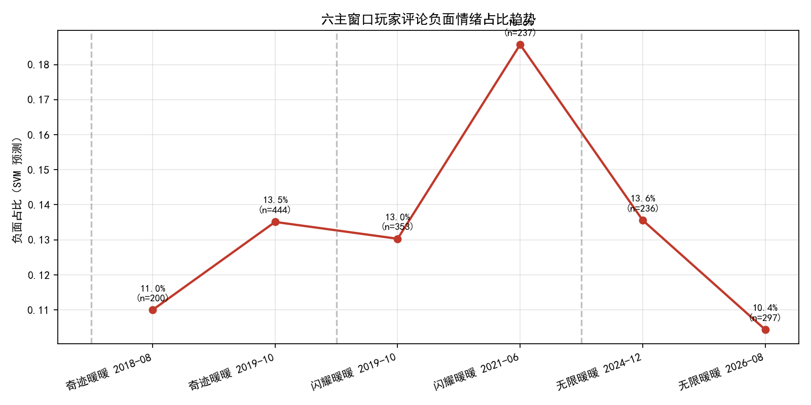
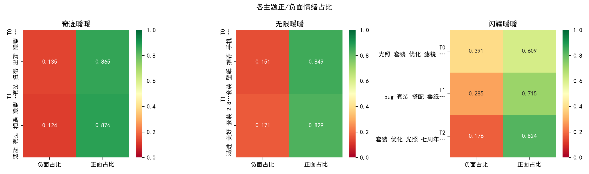

# 游戏用户体验分析 | Game Experience Analytics

> **方向**：文本挖掘 · 用户研究 · 产品分析

## 30 秒了解

| 项目 | 内容 |
| --- | --- |
| 目标 | 从中文游戏评论中提取情感和体验主题，支持版本反馈与产品诊断 |
| 我的工作 | 数据清洗、弱监督标注、情感分类、LDA 主题建模、事件前后对比 |
| 技术 | `Python` `pandas` `TF-IDF` `SVM` `LDA` `jieba` `scikit-learn` |
| 结果 | Linear SVM Accuracy `0.865`，F1 `0.905` |
| 证据 | 聚合指标、情感趋势图、主题热力图、可复现实验代码 |

## 关键结果

| 模型 | Accuracy | F1 |
| --- | ---: | ---: |
| Linear SVM | 0.865 | 0.905 |
| Naive Bayes | 0.833 | 0.888 |
| Logistic Regression | 0.820 | 0.880 |





## 项目方法

- 将 CSV/XLSX 评论统一为可分析数据集，过滤广告、投票和离题文本。
- 使用否定感知规则完成弱监督情感标注。
- 使用 TF-IDF 对比 Naive Bayes、Logistic Regression 和 Linear SVM。
- 使用 LDA 识别体验主题，并进行主题数选择、稳定性检查和事件窗口比较。

## 代码入口

```text
analysis/src/run_all.py          # 一键运行
analysis/src/preprocess.py       # 中文清洗与分词
analysis/src/sentiment_ml.py     # 情感分类
analysis/src/lda_topics.py       # 主题建模
analysis/src/event_comparison.py # 事件窗口比较
```

运行说明见 [`analysis/README.md`](analysis/README.md)。无本地数据时会生成脱敏演示数据。

## 隐私边界

不包含原始评论、用户名、联系方式、逐行预测结果或学术提交文件，仅保留代码、聚合结果和图表。
